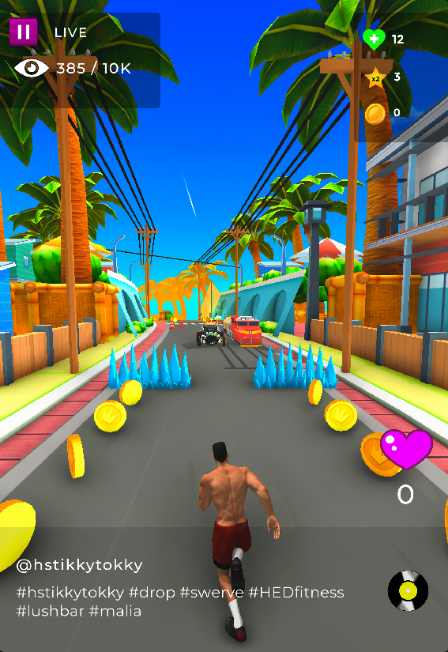

# TikkyTokkyDropGame

"*not the official Github Repo*"
  
  <a href="https://www.rahulchandraportfolio.com/tikkytokkydropgame" target="_blank">TikkyTokky Drop Game </a> is an endless influencer runner like you've never seen before.
 Run, dodge and get points for swiping up and down at the right time.
  
 

  
  

  
  

  
  &nbsp;  &nbsp;    
  
  

  
 
 

<h1 align = "center">Gameplay</h2>

  
<b>Project Type</b>: made under BeGames LTD 
<b>Engine </b>:  Unity 3D  
<b>Programming Language</b>: C#  
<b>Role</b>: Game Programmer  
<b>Version Control</b>: Git  
<b>Assets</b>: Unity Asset store  
  
  

 

